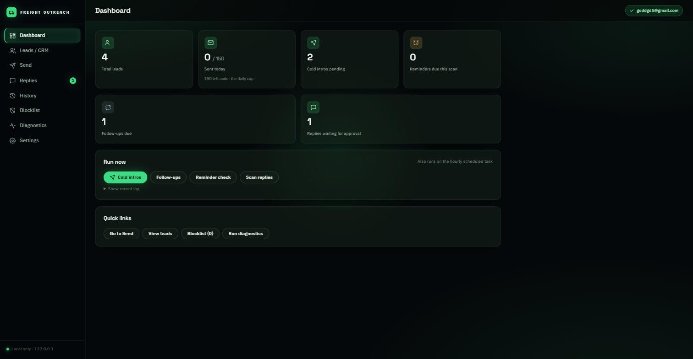
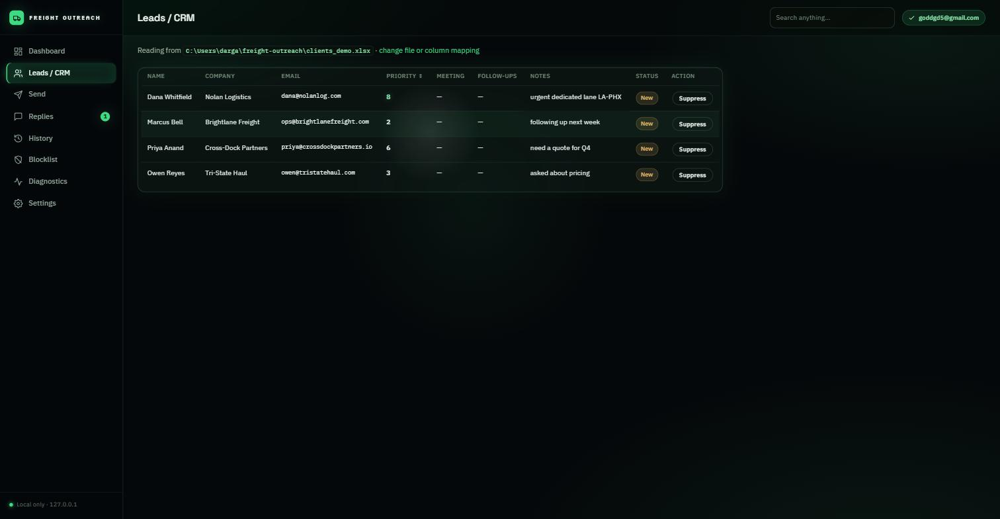
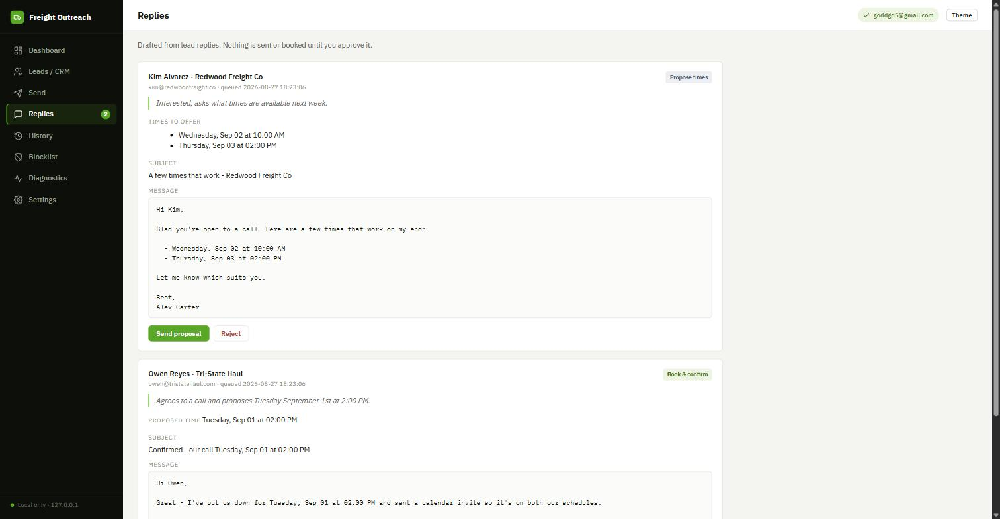
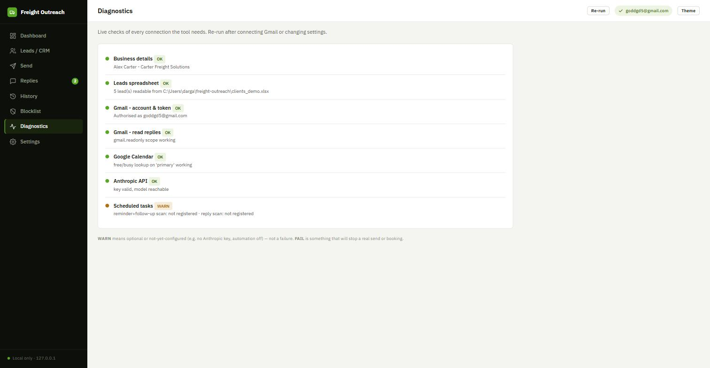

<div align="center">

# Freight Outreach

**A local, single-client cold-email and follow-up tool for a freight brokerage — leads live in one Excel file, nothing is hosted, nothing sends or books without your approval.**


</div>

---

## What it is

Freight Outreach is a desktop app for one freight brokerage to run its own outbound email.
It reads leads from an Excel spreadsheet on the PC, sends personalised cold-intro emails,
chases the non-responders with a multi-touch follow-up drip, and emails a reminder about
24 hours before any scheduled call. Optionally it also **reads the replies**: Claude Haiku
classifies each response (yes / no / maybe / question) and, for a "yes", drafts a Google
Calendar invite plus a confirmation email that you approve on a **Replies** page. Nothing is
ever sent or booked automatically — every outbound action waits for a click.

There is no database, no server, and no hosting. Everything — the leads file, the settings,
the logs, the OAuth token — lives in one folder on the user's machine. Email goes out through
the user's own Gmail account over a real Google sign-in (OAuth), not SMTP or app passwords.

---

## Screenshots

<table>
  <tr>
    <td align="center"><br><sub>Dashboard — stat tiles and the Run now panel</sub></td>
    <td align="center"><br><sub>Leads — every column, priority score, per-lead suppress</sub></td>
  </tr>
  <tr>
    <td align="center"><br><sub>Replies — drafted actions awaiting approval</sub></td>
    <td align="center"><br><sub>Diagnostics — live connection checks</sub></td>
  </tr>
</table>

---

## Features

| Feature | What it does |
|---|---|
| **Cold intro** | Emails every lead in the sheet that has no `ColdEmailSentAt` yet, using your own Jinja2 templates with each lead's details merged in. |
| **Follow-up drip** | Up to three spaced nudges to cold leads who never replied. Configurable cadence (default 3 / 7 / 14 days after the intro), with a soft "breakup" email on the last touch. Stops the instant a lead replies or books. Opt-in. |
| **24h reminders** | A background scan finds leads whose `MeetingDateTime` is roughly 24 hours away and sends one reminder each. The scan window overlaps between runs so no meeting slips through. |
| **Reply handling & auto-scheduling** | Reads the latest inbound message per lead thread, classifies it with Claude Haiku, and drafts the follow-up: a calendar invite + confirmation for a free "yes", a "here are some open times" email otherwise, a polite acknowledgement for a "no". Draft-and-approve only. Optional. |
| **Lead priority score** | When the daily cap can't fit every queued lead, the highest-priority ones send first. Uses a numeric `Priority` column from the sheet if present, otherwise a small rules score from company / phone / notes-keyword hits. No AI, nothing written back. |
| **Blocklist & suppression** | A permanent blocklist by domain or address, plus a per-lead `Suppressed` flag on the sheet. Both are checked before every send. |
| **Daily send cap** | One combined cap across all flows (default 150, well under Gmail's own limit). Cold and follow-up overflow defers to the next run; reminders log a critical warning if capped. |
| **Excel column auto-detection** | Matches your own headers — `Surname`, `Organisation`, `E-mail Address`, a split first/last name — to the logical fields, with a manual override per field in Settings. A row with only an email address still works (name from the local part, company from the domain). |
| **Scheduled tasks** | Two optional Windows Task Scheduler jobs run the reminder + follow-up scan and the reply scan hands-off, whether or not the dashboard is open. |
| **Native desktop app** | `python -m outreach` or a double-click opens a real application window via pywebview and the WebView2 runtime already built into Windows 11 — no bundled Chromium. `--web` forces a browser tab. |
| **Offline dashboard** | A dark, spring-green interface — all styling and fonts served locally, no CDN, works with no internet. |

---

## Quick start

```bash
git clone https://github.com/Nightdreams-bat/freight-outreach.git
cd freight-outreach
pip install -r requirements.txt
python -m outreach
```

`python -m outreach` opens the dashboard in a native window. `config.json` is created with
defaults on first run — there is no setup wizard; everything is configured on the **Settings**
page, and the dashboard shows a short checklist until the essentials are filled in.

Before real sending works you need a one-time Google Cloud OAuth client (Gmail API + Calendar
API + an OAuth consent screen with your sending addresses as test users), and — only for reply
handling — an Anthropic API key from [console.anthropic.com](https://console.anthropic.com)
(a pay-as-you-go key, roughly $0.001 per reply on Haiku; **not** a Claude.ai subscription).
The full walkthrough is in **[`docs/SETUP.md`](docs/SETUP.md)**.

### Packaged build (client gets no Python)

```powershell
.\build.ps1
```

`build.ps1` runs PyInstaller against `FreightOutreach.spec`, self-checks the result, and
assembles `release\FreightOutreach\` — a single folder (`FreightOutreach.exe`, `_internal\`,
`client_secret.json`, `Source code\`, `START HERE.txt`) that runs entirely on the client's PC.
See **[`BUILD.md`](BUILD.md)**.

---

## How it works

```
              clients.xlsx  (the entire lead "database")
                     |
                     v
             outreach/core.py   <-- all sending logic: candidates, daily-cap trim, send loop
             outreach/excel_store.py, scoring.py, templates.py, ...
                     |
      +--------------+---------------+----------------------+
      |              |               |                     |
  Flask dashboard    CLI flags   Windows scheduled tasks   Replies approval queue
  (native window)   (--cold ...)  (--reminders / --replies)  (reply_queue.jsonl)
```

Every interface calls into the same `outreach/core.py` functions, so the dashboard, the CLI,
and the scheduled tasks can never behave differently. Email is sent through the Gmail API and
calendar invites are created through the Google Calendar API, both under a single real OAuth
sign-in; the token is stored in the Windows Credential Manager via `keyring` and auto-refreshes.
Reply text is the only thing sent to Claude, and only when reply handling is switched on.

For the reply-handling design and contract, see
**[`docs/reply-handling-design.md`](docs/reply-handling-design.md)**.

---

## CLI reference

Run `python -m outreach <flag>` from source, or `FreightOutreach.exe <flag>` from the build.

| Flag | Effect |
|---|---|
| _(none)_ | Open the dashboard in a native desktop window. |
| `--web` | Open the dashboard in the default browser instead of a window. |
| `--cold` | Send the cold-intro batch now, headless. |
| `--followup` | Send any due follow-up nudges now, headless (opt-in via config). |
| `--reminders` | Run the reminder + follow-up scan now, headless (used by the `FreightOutreach_ReminderCheck` task). |
| `--replies` | Scan for lead replies and draft actions, headless (used by the `FreightOutreach_ReplyCheck` task). Never sends or books. |
| `--selfcheck` | Verify a freshly built `.exe` has everything it needs. |

---

## Dashboard pages

| Page | Purpose |
|---|---|
| **Dashboard** | Stat tiles (leads, sent today, remaining under the cap, pending replies, ...) plus a **Run now** panel that triggers the cold / follow-up / reminder / reply-scan jobs in the background with a live log tail. |
| **Leads** | Every column from the sheet, the derived name/company for email-only rows, the computed priority score, and per-lead Suppress / Unsuppress. |
| **Send** | Everything currently queued for each flow, ordered by priority, with a button to send a batch on demand. |
| **Replies** | Each drafted action from a lead reply — Claude's read of the message and the draft invite/email. **Approve** does the real work; **Reject** discards it. |
| **History** | A log of every email actually sent. |
| **Blocklist** | Add or remove blocked domains and addresses. |
| **Diagnostics** | Active connection checks — Gmail send, Gmail read, Google Calendar, Anthropic, scheduled tasks, spreadsheet — each OK / WARN / FAIL. |
| **Settings** | Business details, Excel file picker, column mapping, Connect Gmail, follow-up drip, reply handling + API key, email templates, sending limits, automation toggles. |

---

## Configuration

`config.json` is written with sensible defaults on first run and migrated forward on later
upgrades. There is no wizard — every field is editable on the **Settings** page:

- **Business details** — sender name, company, phone, one-line pitch (merged into templates).
- **Excel file & column map** — path to the leads sheet and the Name / Company / Email / Phone / Priority mapping.
- **Email templates** — cold intro, reminder, the three follow-up bodies, and the reply-handling emails, all Jinja2.
- **Sending limits** — daily send cap, reminder window / interval, per-run safety caps.
- **Reply handling** — Anthropic API key (stored in the credential store, never in a file), model, meeting duration, business hours/days, scheduling window, minimum notice.

Credentials (`client_secret.json`, the OAuth token, the Anthropic key) and user data
(`config.json`, `clients.xlsx`, `send_log.json`) are gitignored. Full setup:
**[`docs/SETUP.md`](docs/SETUP.md)**.

---

## Development

```bash
python -m pytest tests/          # 188 tests, fully network-free (Gmail / Calendar / Anthropic are faked)
```

### Project layout — `outreach/` package

| Module | Responsibility |
|---|---|
| `__main__.py` | Single entry point; dispatches the CLI flags or opens the dashboard. |
| `desktop.py` | Runs the dashboard in a native pywebview window (WebView2), with browser fallbacks. |
| `web/app.py` | The Flask dashboard — all routes and the background "Run now" job runner. |
| `web/templates/`, `web/static/` | The eight dashboard pages and the offline stylesheet. |
| `core.py` | Shared sending logic: candidate selection, daily-cap trim, the cold / reminder / follow-up send loops. |
| `config.py` | Load / save / migrate `config.json`. |
| `excel_store.py` | Read and write `clients.xlsx` — the whole lead store. |
| `column_map.py` | Detect which of the sheet's headers map to Name / Company / Email / Phone / Priority. |
| `lead_fields.py` | Derive a greeting name and company for rows that have only an email address. |
| `templates.py` | The default Jinja2 email templates and the render helper. |
| `scoring.py` | Rules-based lead priority score. |
| `mailer.py` | Build and send the MIME message through the Gmail API. |
| `gmail_oauth.py`, `credentials.py` | The Connect Gmail OAuth flow and the `keyring` token store. |
| `gmail_read.py` | Fetch the latest inbound message per lead thread, strip quoted history. |
| `llm.py` | `classify_reply()` — one forced-tool-use Claude Haiku call. |
| `calendar_api.py` | Google Calendar free/busy, open-slot search, event creation. |
| `scheduling.py` | Turn a classification into a drafted action (`book` / `propose` / `decline_ack` / `manual`). |
| `reply_queue.py` | The approval queue; `approve()` is the only code that sends or books. |
| `process_replies.py` | The headless reply scan (`--replies`). |
| `send_cold.py`, `send_reminders.py`, `send_followups.py` | The headless send entry points. |
| `blocklist.py`, `manage_blocklist.py` | Permanent block-by-domain-or-address. |
| `send_tracker.py` | Daily send counter and the History log. |
| `schedule_task.py` | Create / remove / query the Windows Task Scheduler jobs. |
| `diagnostics.py` | The active connection checks behind the Diagnostics page and `--selfcheck`. |
| `paths.py` | The one place that resolves file locations for source vs. frozen builds. |

---

## Privacy

Everything runs on the user's own PC. The only data that ever leaves the machine is:

1. The emails the user chooses to send, through the user's own Gmail account.
2. Calendar invites the user approves, created in the user's own Google Calendar.
3. If reply handling is enabled — the text of each lead reply, sent to Anthropic for a
   yes/no/maybe/question reading.

There is no telemetry, no analytics, no third-party hosting, and no open/click tracking.

---

## License

This project does not currently carry a license file. Check the
[repository](https://github.com/Nightdreams-bat/freight-outreach) for a `LICENSE` before reuse.
